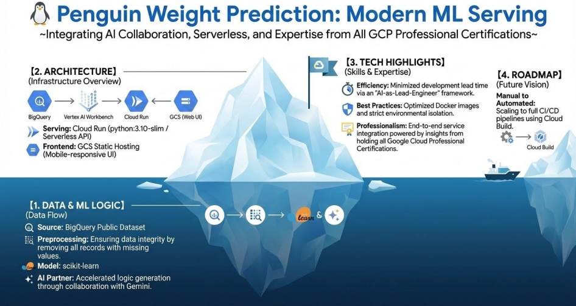
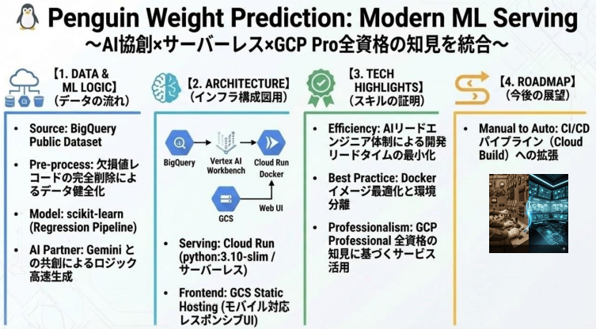

# MLOps Architecture Showcase on Google Cloud

## Architecture
Integrating 20 years of operational discipline with modern ML practices.

  
  

## Technical Documents (PDF)
- [Download ML Architecture(EN)](docs/TechDoc_MLDemo_PenguinML.pdf)
- [Download ML Architecture(JP)](docs/技術資料_機械学習デモ_PenguinML.pdf)
- [Download CI/CD Implementation(EN)](docs/TechDoc_CICDImpl.pdf)
- [Download CI/CD Implementation(JP)](docs/技術文書_CICDパイプライン構築.pdf)

## Demo & Source
- **Environment:** Google Cloud - Vertex AI(Workbench/JupyterLab), Cloud Build, Cloud Run
- **Live Demo(Production):** <https://storage.googleapis.com/ml-test001-publicfiles/index.html>
- **Live Demo(Development):** <https://storage.googleapis.com/ml-test001-publicfiles/index-dev.html>
- **Source(GitHub):** <https://github.com/tommy1231net/ml-test001>

## About Me
- **My Profile(Linkedin):** <https://www.linkedin.com/in/takehiko-tomihisa-632592397/>  
Future MLOps Engineer / 20+ years IT Infrastructure & Cloud Ops  
Google Cloud Certified: All 9 Professional Certifications

